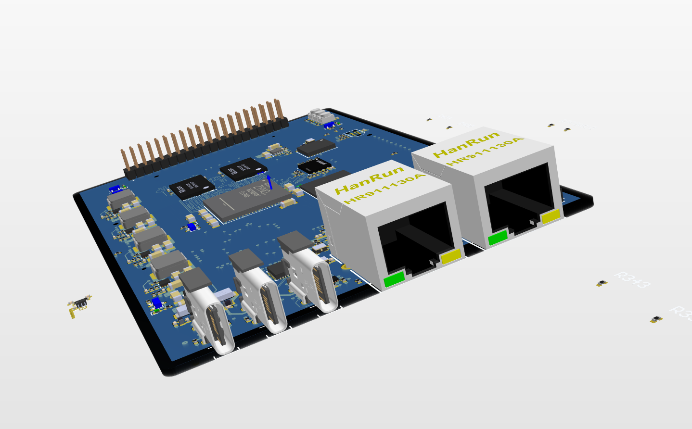
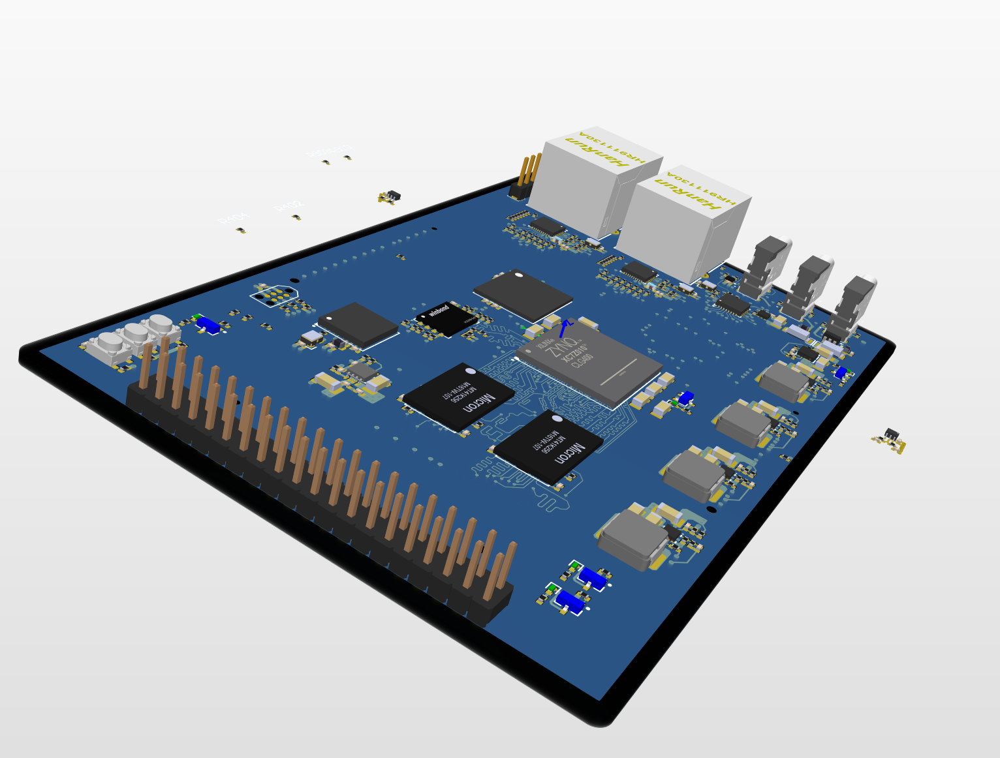
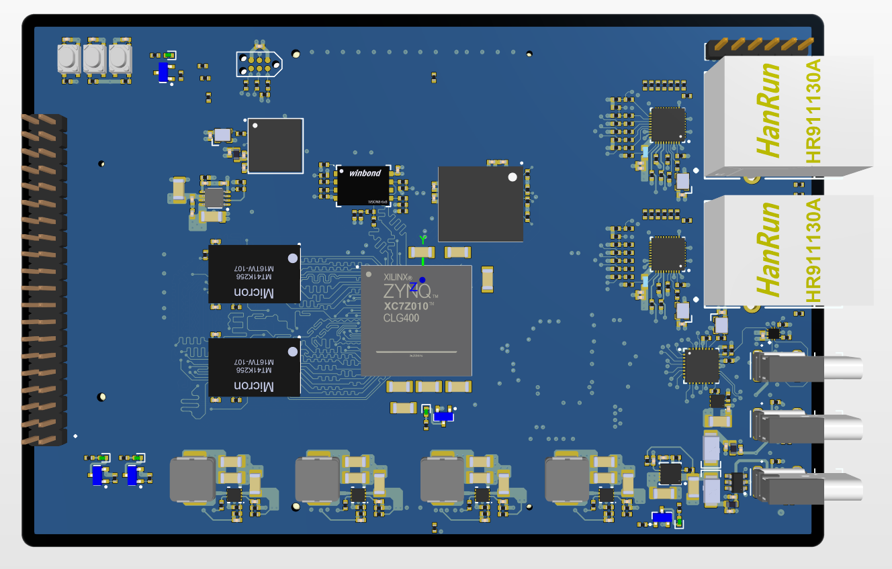
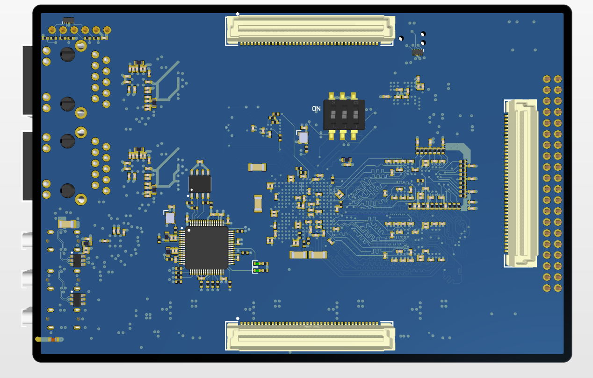
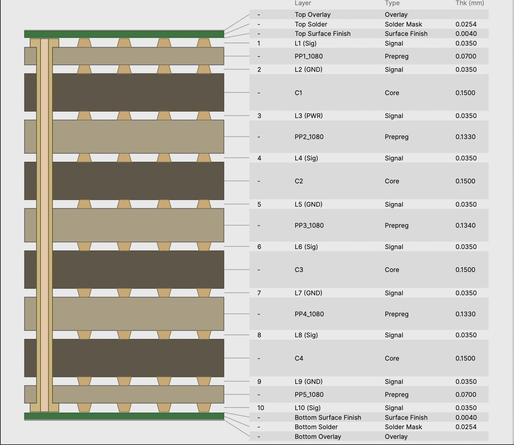
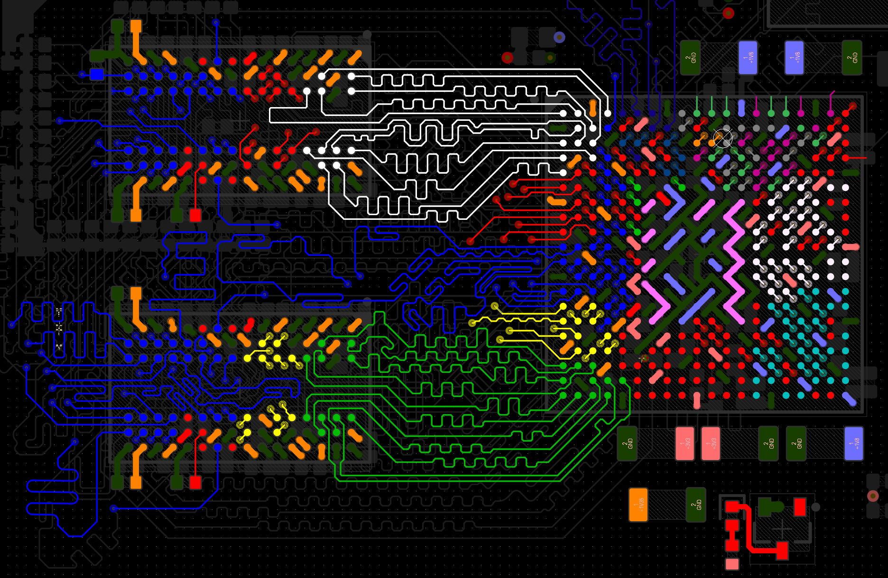
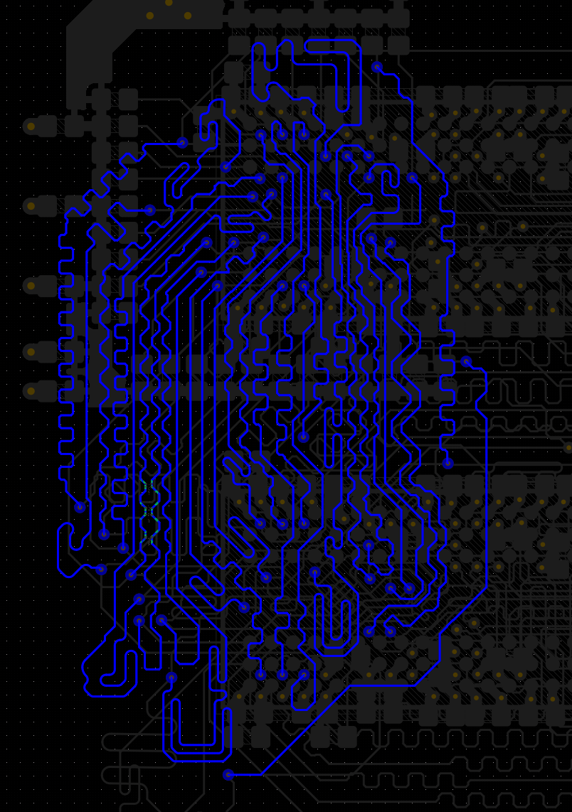
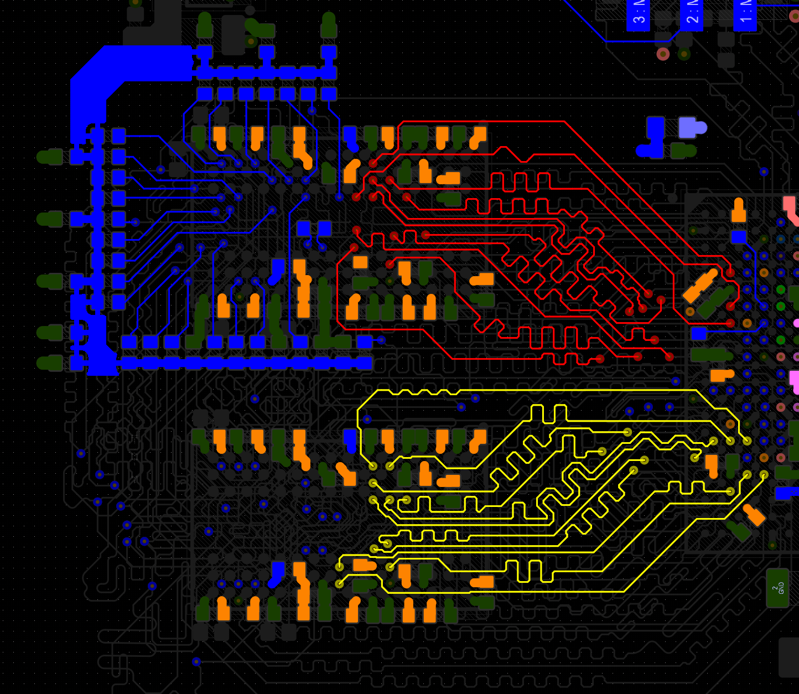
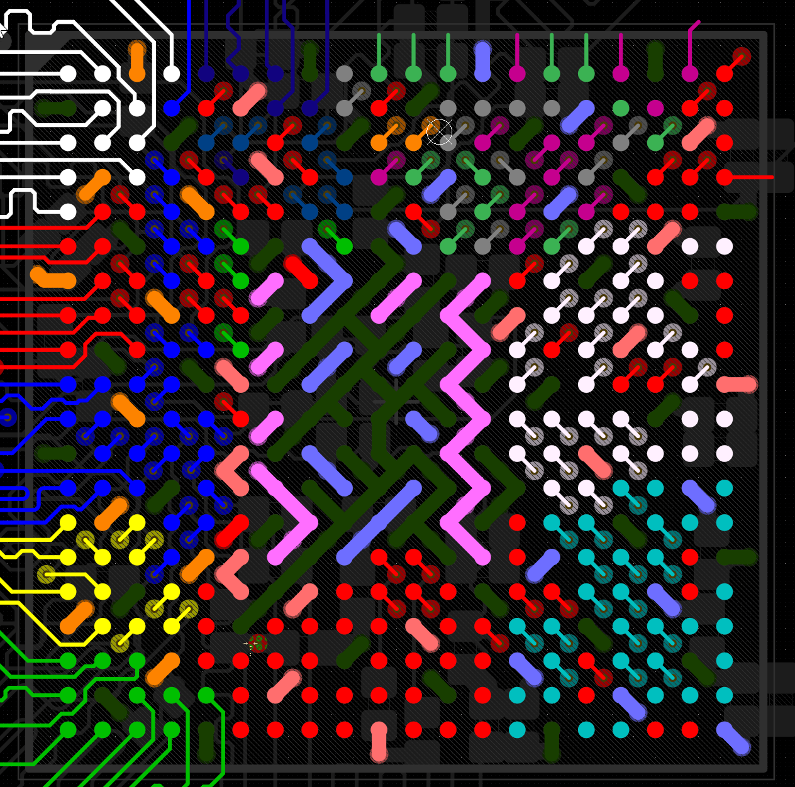
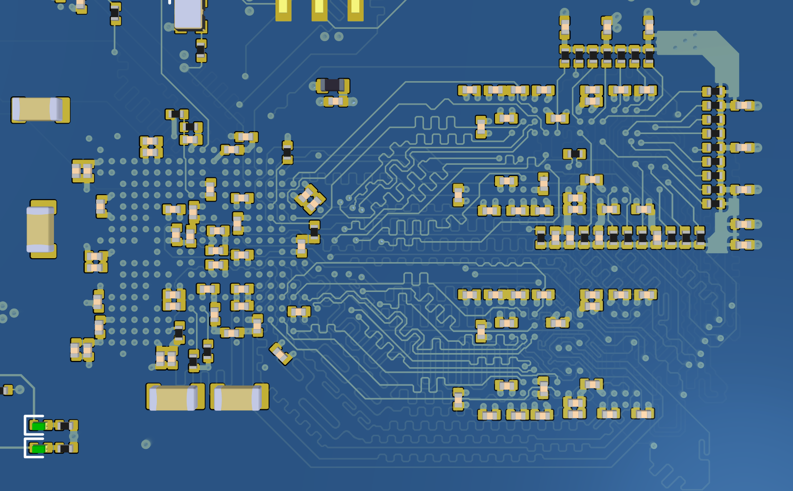

# Prometheus PX-1 — Custom Zynq-7000 SoC Development Board

> A custom AMD Zynq-7000 SoC carrier board designed from schematic capture through PCB layout as a personal deep-dive into high-speed digital design. Targeting SDR and UAV flight controller applications. Manufacturing and bringup pending.

---

## Overview

Prometheus PX-1 is a custom development board built around the **AMD XC7Z010-2CLG400I** — a dual-core ARM Cortex-A9 processor tightly coupled with Artix-7 FPGA fabric in a 400-ball CLG package. The design targets two application domains: software-defined radio (SDR), where the PL fabric handles real-time DSP, and UAV flight control, where the PL enables deterministic low-latency control loops alongside a dedicated platform MCU.

The board was designed entirely in **Altium Designer** without access to industry SI simulation tools. Every stackup choice, reference plane decision, and timing constraint was derived from datasheet requirements, application notes, reference designs, and first-principles signal integrity reasoning — forcing a deeper understanding of *why* the rules exist.

<table>
  <tr>
    <td align="center"> ISO Front render</td>
    <td align="center"> ISO Back render</td>
  </tr>
  <tr>
    <td align="center"> Top View</td>
    <td align="center"> Bottom View</td>
  </tr>
</table>

---

## Hardware Features

| Subsystem | Detail |
|---|---|
| **SoC** | AMD XC7Z010-2CLG400I (dual ARM Cortex-A9 + Artix-7 PL, 400-ball CLG, 0.8mm pitch) |
| **Memory** | 1 GB DDR3L (2× MT41K256M16TW), fly-by topology, VTT termination regulator, matched termination resistors |
| **Boot storage** | 32 MB QSPI flash for First Stage Boot Loader (FSBL) → 32 GB eMMC for embedded Linux |
| **Ethernet** | Dual Gigabit via Realtek PHY over RGMII, RJ45 MagJack|
| **USB** | USB 2.0 High Speed (USB3320C ULPI PHY), Type-C connector with CC logic controller and host/device dual role switching |
| **Platform MCU** | STM32H743VIH6 in BGA package — PWM, encoders, CAN, ADC, PPS, SPI/UART link to SoC |
| **Debug** | FT4232HL quad USB-UART/JTAG bridge (adapted from AMD VCK190 reference design), Tag Connect SWD header for ST-Link |
| **Expansion** | SYZYGY-compatible connectors with fixed I2C DNA addressing |
| **Power** | 4× synchronous buck converters (1V0, 1V8, 1V35, 3V3) with PG startup sequencing; LS1205E e-fuse on USB-C input |

---

## PCB Design

### Stackup — 10 layers, 1.5488mm

**Vias:** Design uses **thru-vias only**. No blind or buried vias — all fanout achieved with dogbone patterns to keep manufacturing within standard capabilities and low cost.

Key stackup decisions:
- Four dedicated GND layers (L2, L5, L7, L9) ensure every signal layer has a solid adjacent ground reference - **improved SI/EMI**
- L3 is a segmented power plane — adjacent to L2 GND minimizing power delivery inductance → PDN carefully considered to reliably supply power hungry devices during switching transients
- Copper balance on all layers minimises board bow and twist
- High speed signal groups routed on inner signal layers buried between ground planes to **minimize crosstalk and EMI**

### Signal & Power Integrity

Without access to simulation tools, every SI decision was grounded in rule-based practice or derived directly from datasheets (AMD UG933, DS187, and JEDEC DDR3L specifications):

- **Impedance control** — all differential pairs and single-ended high-speed nets impedance controlled
- **DDR3L timing** — address/command & control and data byte lanes delay matched within ±10 ps using length tuning in Altium accounting for pin-package delays also; fly-by topology with a single VTT rail (BD3539FVM) and explicit 49.9Ω termination resistors on each group per NXP application note 
<table>
  <tr>
    <td align="center"> ACC signals — L1</td>
    <td align="center"> ACC signals — L6</td>
    <td align="center"> VTT termination — L10</td>
  </tr>
</table>

- **BGA fanout** — five BGA components including the Zynq (0.8mm pitch, 400-ball CLG400) and STM32H743 (0.8mm pitch, BGA169) fanned out using dogbone via patterns without HDI

<table>
  <tr>
    <td align="center"> SoC BGA Fanout</td>
    <td align="center"> BGA Decoupling</td>
  </tr>
</table>

- **Reference plane management** — every signal layer transition checked; no net crosses a plane split; all high-speed signals routed over continuous GND reference; transfer vias placed adjacent to signal layer transistions maintaining consistent return paths; layer transitions carefully thought out to minimize via stubs on high speed signals
- **Power sequencing** — four AP3441 buck converters start in the sequence mandated by the Zynq-7000 datasheet (1V0 → 1V8 → 1V35 → 3V3); sequencing achieved by chaining PG open-drain outputs through RC networks (100nF / 100kΩ, τ ≈ 10ms) into the EN pin of the next converter, ensuring each rail is stable before the next enables

## Schematic Structure (12 sheets, Rev C)

| Sheet | Title | Key content |
|---|---|---|
| 1 | Overview | Block diagram, inter-sheet signal index |
| 2 | Power Supplies | 4× AP3441 buck converters, LS1205E e-fuse, VTT regulator, power sequencing, PG_ALL logic |
| 3 | SoC Power | Zynq-7000 supply pins, full decoupling network per UG933, PLL filtering, bank voltage assignments |
| 4 | SoC Config | JTAG chain, FT4232HL USB-to-JTAG/UART bridge (adapted from VCK190 reference), boot mode strapping switch|
| 5 | SoC PS | PS bank 500 (3.3V) and 501 (1.8V) pinout, 33.33 MHz PS clock (TCXO), QSPI flash, 32GB eMMC, RGMII to both ETH PHYs, ULPI USB, boot mode config |
| 6 | SoC PL | PL bank 34 (1.8V) and 35 (3.3V) pinout, SYZYGY A and B connector mapping, MCU↔SoC SPI/UART, ETH PHY control signals, 125 MHz clock from ETH0 PHY |
| 7 | SoC DDR Interface | Zynq DDR502 bank pinout, fly-by bus grouping (DDR3_ACC, DDR3_BL0–BL3)|
| 8 | DDR3L Memory | 2× MT41K256M16TW modules, fly-by address/command/control topology (Mod1 → Mod2 → VTT), per-byte-lane DQS/DQ/DM grouping|
| 9 | Gb Ethernet | 2× Realtek 1Gb PHY,  integrated MagJack, RGMII series resistors|
| 10 | USB 2.0 HS | USB3320C ULPI PHY, TUSB322I Type-C CC controller, NCP380 host/device switch|
| 11 | Platform MCU | STM32H743VIH6, JTAG + Tag Connect SWD header, 8× PWM channels, 2× quadrature encoders, CAN, 3× UART, 2× SPI, I2C, 4× ADC inputs, PPS in/out, SYZYGY DNA I2C bus |
| 12 | Expansion Connectors | 2× 80-pin SYZYGY FPGA connectors, 1× 80-pin MCU expansion connector, 1× 40-pin MCU header, fixed I2C DNA addressing|

---

## Design Intent & Lessons

The goal of this project was less about producing a perfect first-spin board and more about facing every hard problem in high-speed, high-density design head on — moving beyond just following tutorials by building and owning something myself. The sheer complexity of the board combined with no access to simulation tools meant every layout decision had to be deliberate and defensible. Managing reference planes across a 10-layer stackup, fanning out fine-pitch BGAs without HDI, DDR3L fly-by routing and termination, power sequencing — all of it required going deep: reading dozens of datasheets and app notes, studying reference designs, and working through technical presentations from people like Rick Hartley and Eric Bogatin. This project challenged me in every dimension of PCB design and pushed me toward a genuine first-principles understanding of signal integrity, EMI, and PDN.

> **Status:** Routing finalization and DRC in progress. Manufacturing submission pending. Bringup notes will be added post-assembly.

---

## Tools & References

| Tool / Document | Purpose |
|---|---|
| Altium Designer | Schematic capture and PCB layout |
| Xilinx Vivado | SoC pinout planning|
| AMD UG933 | Zynq-7000 PCB design guide — decoupling, power, SI |
| AMD DS187 | Zynq-7000 datasheet — voltage specs, power sequencing |
| AMD UG585 | Zynq-7000 TRM — boot mode, MIO, PS configuration |
| AMD UG908 | Zynq-7000 configuration memory device guide |
| NXP AN2582 | Hardware and Layout Design Considerations for DDR Memory Interfaces |
| Swissbit AN-EM-10 | eMMC layout and decoupling guidance |
| SYZYGY Specification | Opal Kelly SYZYGY pod interface standard |
| AMD VCK190 reference | FT4232HL USB-JTAG schematic reference |

---

## Author

**John Alexander** — designed as a personal project to develop hands-on expertise in high-speed digital PCB design.
